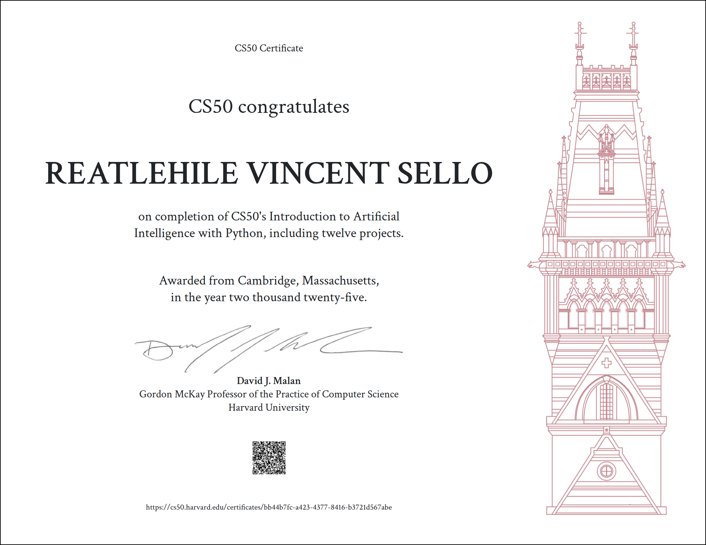
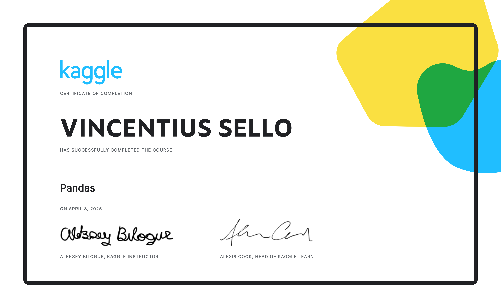
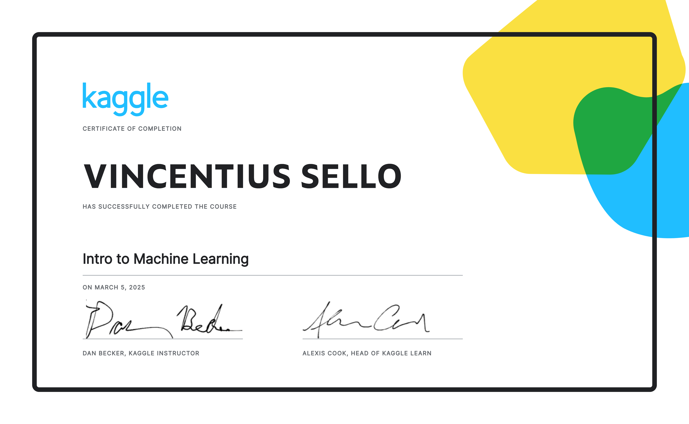
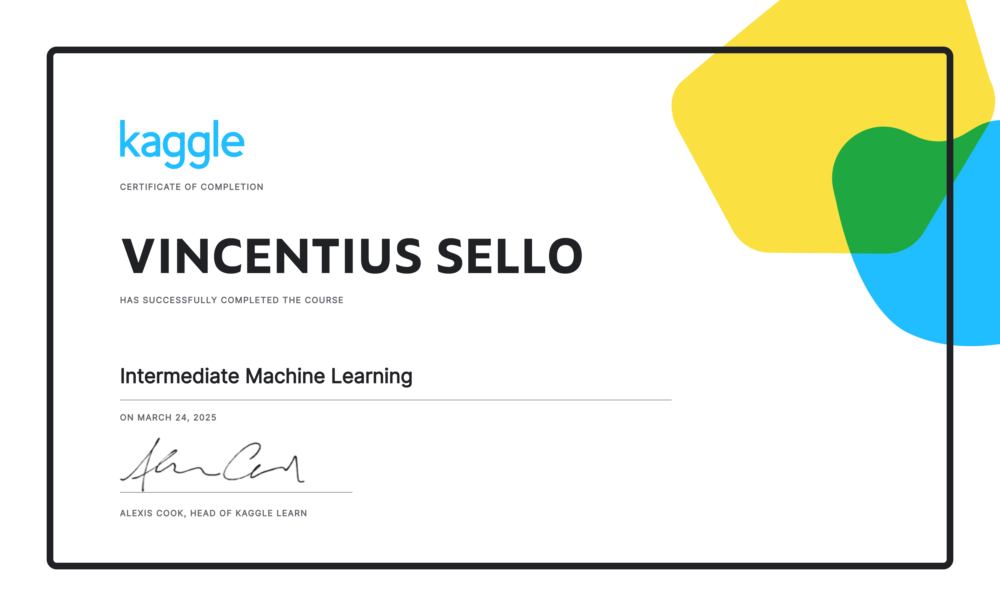

        
     
     
    

  
  
  

<h3 align="center">
  <em>👩‍💻 ML Engineer | AI Engineer | Data Engineer | Software Engineer ✨</em>
</h3>

## 👻 Who is Vincentius...  

Hy there, I'm Vincent. I'm currently pursing a Bachelor of Science degree in Computer Science & Informatics With AI
@ University of Johannesburg.

Aspiring Data Engineer and AI/ML Engineer with a strong foundation in data pipelines, machine learning algorithms, and cloud technologies. 
Proficient in Python, SQL, and tools like Pandas, Scikit-learn, and TensorFlow. Passionate about transforming raw data into actionable 
insights and building intelligent systems that solve real-world problems. 
Eager to contribute to innovative teams and continuously grow in the fields of data engineering and artificial intelligence.

<h2>🗂 Online Certificates</h2>

    

        <li><a  href="./assets/RV_SELLO_PYTHON_ESSENTIALS_1.pdf">Python Essentials 1 Certificate</a></li>
        <li><a  href="./assets/OpenCV Free OpenCV Bootcamp Certificate _ OpenCV.pdf">OpenCV Bootcamp Certificate</a></li>
        <li><a  href="./assets/RV_SELLO_INTRODUCTION_TO_DATA_SCIENCE.pdf">Intro Data Science Certificate</a></li>
        
        
        
        
        
        
        
    

# 💻 Tech Stack:

                           

# 📊 GitHub Stats:
 
 

### ✍️ Random Dev Quote

## 🎯 What's Next?

  

- 🌍 **Open Source Contributions:** Planning to contribute to projects in the field of AI & ML
- 🏆 **Certifications:** Obtain AI & ML Certificates from Havard/Stanford (Online Courses)
- 🚀 **Projects:** New projects on AI, ML and Data Engineering

  <h3>🚀 Ready to Make a Collaboration? 🚀</h3>
  
No matter, what you have in mind [new project], [an open-source contribution], or [just a tech talk] - I'd love to connect!

  

<!-- Stylized Footer -->

  

